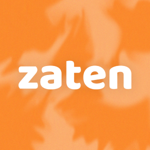
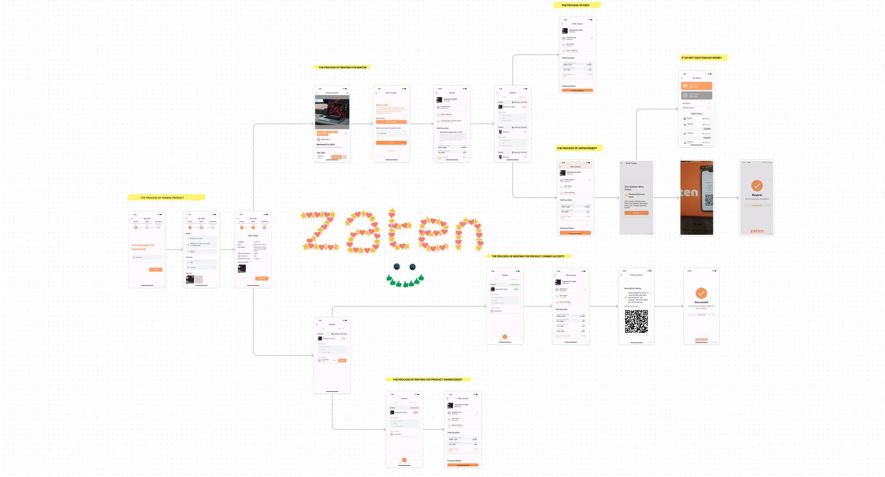

  <html>
  <body>

  

  
  # **Team & Product Name**

  ### **`zaten`**

  # Information About Team and Product

  ## Team Members

  <table>
    <tr>
      <th></th>
      <th>Name</th>
      <th>Title</th>
      <th>Socials</th>
    </tr>
    <tr>
      <td></td>
      <td>Burak Taha Cevheroğlu</td>
      <td>Scrum Master</td>
      <td>
        
        
        
      </td>
    </tr>
    <tr>
      <td></td>
      <td>Arda Demirel</td>
      <td>Product Owner</td>
      <td>
        
        
      </td>
    </tr>
    <tr>
      <td></td>
      <td>Dila Hazal Bilgin</td>
      <td>Developer</td>
      <td>
        
        
      </td>
    </tr>
    <tr>
      <td></td>
      <td>Merve Ağaçayak</td>
      <td>Developer</td>
      <td>
        
        
      </td>
    </tr>
    <tr>
      <td></td>
      <td>Onur Konuk</td>
      <td>Developer</td>
      <td>
        
        
          
      </td>
    </tr>
    <tr>
    <td></td>
    <td>zaten</td>
    <td>Startup</td>
    <td>
      
      
    </td>
  </tr>
  </table>

  ## Product Description
  zaten is a platform where users can securely rent their belongings or vehicles to one another. We are aware of the excessive and imbalanced production in the world and the resulting environmental damage. The long-term goals of zaten are to reduce energy consumption due to imbalanced production, decrease waste generated from overconsumption, and support a circular economy by encouraging the reuse of unused items. In doing so, we offer an economically beneficial solution to individuals amidst rising product prices, while also reducing pressure on biodiversity. Building a solid technological infrastructure and establishing a reliable legal foundation are among our core objectives.

  

    
<h2>Product Features</h2>

  <h3>Item Rental:</h3>
    
zaten allows users to rent out their belongings to others. Users can easily initiate the rental process, share item details, and rent out their items to others for a suitable fee.

  <h2>Vehicle Rental:</h2>
    
zaten enables users to rent vehicles. Vehicle owners can rent out their unused vehicles to other users via the zaten platform, earning additional income. Renters can find and rent a suitable vehicle to meet their needs.

  <h2>Secure Payment System:</h2>
    
zaten provides a secure payment system for users to make payments. Rental fees are processed through secure payment transactions conducted on the platform.

  <h2>Rating and Review System:</h2>
    
zaten allows users to rate and review each other. This feature enables users to assess the reliability and satisfaction levels of other users and make informed choices.

  <h2>Reservation Management:</h2>
    
zaten offers users reservation management capabilities. Users can make reservations for items or vehicles for their desired date range and specify the duration of usage.

  <h2>User-to-User Communication:</h2>
    
zaten facilitates communication between users for discussing rental details. Users can directly communicate with item or vehicle owners, ask questions, negotiate prices, arrange delivery, and discuss other details. The chat feature provides a safer and more personalized communication experience, streamlining the rental process.

  <h2>User Support:</h2>
    
zaten provides customer support services to users. Users can contact customer service when they have any issues or questions related to the platform and receive assistance.

  <h2>Categorization and Search:</h2>
    
zaten allows users to categorize and search for items or vehicles. Users can filter based on desired categories or specific features, making it easy to find the item or vehicle they are looking for.

  <h2>Favorites:</h2>
    
The Favorites feature serves as a personal catalog, allowing you to save and organize items or vehicles that have caught your interest. This curated list helps in quick decision-making, allowing you to rent an item whenever you're ready.

  <h2>Making an Offer:</h2>
    
As a prospective renter, you can propose an offer on any product or vehicle you wish to rent. Simply go to the product page, click on 'Make an Offer,' and enter your desired price and date range. Once you submit your offer, it will be sent directly to the product owner for consideration.

  <h2>Receiving and Managing Offers:</h2>
    
As a product owner, you can view all incoming offers on your personal 'Offers' page. Here, you'll see a list of all offers made on your items or vehicles, each with details including the proposed price, the desired rental period, and the prospective renter's information. You can review each offer and decide whether to accept, decline, or negotiate the terms. This feature gives you full control over your rental prices and schedules, allowing you to rent out your belongings or vehicles on your own terms.

  <h2>Our Sponsors' Customizable Profile:</h2>
    
Our goal at zaten is to provide our sponsors with the opportunity to display their products on our platform, thereby encouraging users to rent or purchase them. Through our customizable Sponsor Profile pages that reflect our sponsors' unique brand identities, users can discover and safely rent or purchase the valuable products and services offered by our sponsors.

  <h2>Nearby Products:</h2>
    
When using zaten, our location feature allows users to view products that are nearby. This ensures that potential optimal choices are surfaced based on their locality, offering a more convenient and efficient way for users to discover and rent items. The location feature streamlines the rental process, making it easier for users to find and rent the best products within their immediate vicinity.

  <h2>Multi-language Support:</h2>
    
zaten also features multi-language support, ensuring that our platform is accessible and user-friendly to people from diverse linguistic backgrounds. This feature allows users to navigate the platform, browse items, and communicate with other users in their preferred language. By offering multi-language support, we aim to break down language barriers and foster a more inclusive and global community on zaten.

  

  

    
<h2>Target Audience</h2>

    
zaten's target audience primarily consists of Millennials and Gen Z who value access over ownership and are open to sharing resources. These younger generations are interested in renting various items such as electronics, fashion accessories, sports equipment, and tools. Urban dwellers, especially those in smaller apartments or shared living spaces, who have limited storage, prefer renting items like camping gear, home appliances, and furniture. Travelers and tourists with specific needs during their trips, as well as event planners requiring temporary access to equipment, are also potential users of zaten's app. Additionally, sustainable consumers who care about the environment and reducing waste can be attracted by emphasizing the role of sharing resources in achieving sustainability goals.

  

  --- 

  

  

    
<h1>Sprint 1</h1>

  

    
<h3>Sprint 1 - App Screenshots</h3>

  <table style="width: 100%;">
    <tr>
      <td colspan="4" style="text-align: center;"><h2>Authentication pages</h2></td>
    </tr>
    <tr>
      <td style="width: 25%;"></td>
      <td style="width: 25%;"></td>
      <td style="width: 25%;"></td>
    </tr>
    <tr>
      <td colspan="4" style="text-align: center;"><h2>Homepage and Location pages</h2></td>
    </tr>
    <tr>
      <td style="width: 25%;"></td>
      <td style="width: 25%;"></td>
      <td style="width: 25%;"></td>
    </tr>
    <tr>
      <td colspan="4" style="text-align: center;"><h2>Add Product pages</h2></td>
    </tr>
    <tr>
      <td style="width: 25%;"></td>
      <td style="width: 25%;"></td>
      <td style="width: 25%;"></td>
      <td style="width: 25%;"></td>
    </tr>
    <tr>
      <td colspan="4" style="text-align: center;"><h2>Offers pages</h2></td>
    </tr>
    <tr>
      <td style="width: 25%;"></td>
      <td style="width: 25%;"></td>
      <td style="width: 25%;"></td>
      <td style="width: 25%;"></td>
    </tr>
    <tr>
      <td colspan="4" style="text-align: center;"><h2>Profile and Settings pages</h2></td>
    </tr>
    <tr>
      <td style="width: 25%;"></td>
      <td style="width: 25%;"></td>
      <td style="width: 25%;"></td>
      <td style="width: 25%;"></td>
    </tr>
    <tr>
      <td colspan="4" style="text-align: center;"><h2>Rent Product pages</h2></td>
    </tr>
    <tr>
      <td style="width: 25%;"></td>
      <td style="width: 25%;"></td>
      <td style="width: 25%;"></td>
    </tr>
  </table>
  
   

  

    
<h3>Sprint 1 - Sprint Board Update Screenshots</h3>

    
    
    
    
    
    
  

  

    
<h3>Sprint 1 - Burndown Chart</h3>

    
    
  

  - **Sprint Notes**:
    - It has been decided to use `Trello` for project management.

    - It has been decided to use `Figma` for UI designs.

    - It has been decided to use `Riverpod` for state management.

    - The `MVVM` structure has been set up and it will be proceeded on this basis.

    - It has been decided to use `Firebase` for the backend, and the `GetX` system for the page routing system.

    - It was decided to use `email login` for the login system.

    - It was decided to perform `identity verification` following the login system.

    - It has been decided to use `Hive` as the local database.
  - **Expected point completion within Sprint**: 200 points
  - **Point Completion Logic**: `(205 points completed)` The first sprint has a target of 200 points, the second sprint 100 points, and the third sprint 200 points. A lower point target has been set for the second sprint since there is a national holiday in Turkey during this period and all team members are residing in Turkey.
  - **Daily Scrum**: See file
  - **Product Backlog URL:** Click for Backlog (Trello)
  - **Sprint Review:**
    - Arda and Burak carried out a coordinated effort for the backend and frontend. We have agreed within the team to continue this way in the next sprint.

    - We struggled to decide on an application name for a while. We transitioned from 'zaten' to 'zaten' and took another step towards branding by purchasing the 'zaten.app' domain for the name.

    - The two biggest problems we encountered in this sprint were difficulty in deciding on a color palette and not having completed the logo yet.

    - We learned that the FloatingActionButton usage in the BottomNavigationBar and the notched feature of the navigation bar have been removed in Material 3, we overcame this issue by designing it ourselves.

    - Overall, we believe we had a good sprint process. We experienced a sprint process close to what we planned.

  - **Sprint Review Participants:** `Burak Taha Cevheroğlu`, `Arda Demirel`, `Dila Hazal Bilgin`, `Merve Ağaçayak`, `Onur Konuk`
  - **Sprint Retrospective:**
    - In the second sprint, it was decided in the team meeting that only Arda and Burak would write code for mobile.

    - In the second sprint, we decided to write our own API (for location information).

    - We had to postpone the logo design to the second sprint. We will continue with the design.

    - We will continue to develop the local database system (Hive).

    - As Burak and Arda will continue more with software related tasks, much of the project management has been delegated to the remaining team members.

    - In the second sprint, we will start writing a website for the zaten.app domain we bought for brand recognition. This task has been handed over to Onur.

    - It was decided to establish a review system before the product goes live during the second sprint.

    - For brand recognition and marketing purposes, it was decided to open an Instagram account during the second sprint.

    - In addition to email authentication, it was decided to add the Google auth system in the second sprint.

    - It was decided to add test AdMobs in the second sprint.

    - We decided to start localization and the first languages will be English and Turkish.

    - It was decided to add a user-to-user SDK with the Stream Chat SDK in the second sprint.

  - **Other Notes**:
  

    
<h3>Additional Files</h3>

    <ul>
      <li><strong>Project Scope And Goals:</strong> <a href="./bootcampFiles/sprintOne/projectscopeandgoals.pdf">See file</a></li>
      <li><strong>Target Audience:</strong> <a href="./bootcampFiles/sprintOne/targetaudience.pdf">See file</a></li>
      <li><strong>Conversations:</strong> See file</li>
    </ul>
  

  

  ---

  

    
<h1>Sprint 2</h1>

  

    
<h3>Sprint 2 - Screenshots</h3>

  <table style="width: 100%;">
    <tr>
      <td colspan="4" style="text-align: center;"><h2>Updated Pages</h2></td>
    </tr>
    <tr>
      <td colspan="1" style="width: 25%;"></td>
      <td colspan="1" style="width: 25%;"></td>
      <td colspan="1" style="width: 25%;"></td>
      <td colspan="1" style="width: 25%;"></td>
    </tr>
    <tr>
      <td colspan="4" style="text-align: center;"><h2>Admin Panel</h2></td>
    </tr>
    <tr>
      <td colspan="4"></td>
    </tr>
    <tr>
      <td colspan="4"></td>
    </tr>
    <tr>
      <td colspan="4"></td>
    </tr>
  </table>
  
  

  

    
<h3>Sprint 2 - Sprint Board Update Screenshots</h3>

    
    
    
    
    
  

  

    
<h3>Sprint 2 - Burndown Chart</h3>

    
    
  

  - **Sprint Notes**:
    - The brand color has been changed. It has transitioned to a shade of `orange`.

    - It has been decided to start on the `admin panel`. The application system will be managed from here.

    - It has been decided to add `internationalization` to the application. `For now, four languages` have been added.

    - It has been decided to use the `Stream SDK` for the messaging system

    - It has been decided to use the `In-App Purchase` system for the in-app payment system.

  - **Expected point completion within Sprint**: 100 points
  - **Point Completion Logic**: `(215 points completed)` During the first sprint, we had set a target of 100 points due to the national holiday and a week-long vacation. However, our team worked even harder than in the first sprint and earned more points than we won in the first sprint.
  - **Daily Scrum**: See file
  - **Product Backlog URL:** Click for Backlog (Trello)
  - **Sprint Review**:
    - The logo and colors of `zaten` have been determined. From now on, the brand will continue its life with this color and logo.
    - We have created our own JSON file for location information. As mentioned in the previous sprint retrospective, we can say that we partially wrote our own API.
    - As mentioned in the previous sprint, we have started using `Hive` for the local database.
    - As mentioned, we have started creating an admin panel for our site, zaten.app.
    - As mentioned, an Instagram account has been opened.
    - As discussed, localization has been added and it has been launched with not 2, but 4 languages.
    - The Adding Product Feed Algorithm` backend system has been created and embedded into the application.
    - The proposal creation/viewing system has been added, and the backend has been embedded.
    - The product liking system has been added.
    - We have created personas for our user target audience.

  - **Sprint Review Participants:** `Burak Taha Cevheroğlu`, `Arda Demirel`, `Dila Hazal Bilgin`, `Merve Ağaçayak`, `Onur Konuk`
  - **Sprint Retrospective:**
    - The completion of the payment system has been deferred to the third sprint.
    - The messaging system has been deferred to the third sprint.
    - All the pages for the buttons in the settings will be completed.
    - The user name selection page will be added.
    - As the application has reached the final stages of completion, unit tests and other testing procedures will be written and conducted.
    - In order to gather feedback for the application, we will be conducting usability testing in the coming days.
    - The design for the application's homepage image and profile cover photo will be created.
    - Notifications will be added, and we can consider using OneSignal.
    - The admin panel will be finalized, and the application will be managed from there.
    - The product search system will be added to the application and will be in a usable state.
  - **Other Notes**:
    

    
<h3>Additional Files</h3>

    <ul>
      <li><strong>Our Location API</strong>Go to api</li>
      <li><strong>Explicit Consent Agreement</strong> <a href="./bootcampFiles/sprintTwo/acik_riza.docx">See file</a></li>
      <li><strong>Privacy Notice</strong> <a href="./bootcampFiles/sprintTwo/aydinlatma_metni.docx">See file</a></li>
      <li><strong>User Agreement</strong> <a href="./bootcampFiles/sprintTwo/kullanici_sozlesmesi.pdf">See file</a></li>
      <li><strong>User Personas</strong> <a href="./bootcampFiles/sprintTwo/personas.docx">See file</a></li>
      <li><strong>App Navigation Schema</strong> <a href="./bootcampFiles/sprintTwo/map.png">See file</a></li>
    </ul>
  

  

  ---

  

    
<h1>Sprint 3</h1>

  

    
<h3>Sprint 3 - Screenshots</h3>

      <ul>
        <li><strong>APP Diagram: </strong>Go to diagram</li>
        <li><strong>Carousel Images And Deep Link: </strong>Go to api</li>
        <li></li>
      </ul>
  

  

    
<h3>Sprint 3 - Sprint Board Update Screenshots</h3>

    
    
    
    
    
  

  

    
<h3>Sprint 3 - Burndown Chart</h3>

    
    
  

  - **Sprint Notes**:
    - The internationalization system has been updated. The number of supported languages has been increased from 4 to 7.
    - We have enabled guest login to the application and integrated it into our system.
    - With bug fixing and testing stages, we have solved all the problems that may arise in our application and completed the process.
    - In this final sprint, we dedicated our efforts to enhancing the App Route System by implementing Deep Link functionality. Deep Linking allows users to access specific content or features within the app directly from external sources such as websites, messages, or push notifications.
  - **Expected point completion within Sprint**: 200 points
  - **Point Completion Logic**: `(745 points completed)` Since this is the final sprint, we have completed the system that was planned and started to be implemented in previous sprints, and our sprint score has reached 745 because we completed most of the important features in this sprint.
  - **Daily Scrum**: See file
  - **Product Backlog URL:** Click for Backlog (Trello)
  - **Sprint Review**:
    - We have developed the Notification System that enables users to communicate with each other using onesignal and firestore technologies.
    - As mentioned, we developed the messaging system using the Stream SDK. We have also added the feature that users can share their instant locations with each other during messaging using the Google Maps and Google Maps service. (Google Maps Static API)
    - We successfully created a Payment&Wallet System by leveraging the combined power of Stripe, Riverpod, and Firestore. By integrating Stripe's robust payment infrastructure, Riverpod's efficient state management, and Firestore's scalable database, our system ensures a reliable and user-friendly experience for handling payments and managing digital wallets.
    - We created a review system using Firestore, where users can read and give feedback on each other's experiences. This system allows users to rate and comment on the things they have rented, helping others make better decisions based on shared opinions.
    - The languages we've added to our application are; Turkish, English, French, Japanese, Spanish, Hebrew, and German.
  - **Sprint Review Participants:** `Burak Taha Cevheroğlu`, `Arda Demirel`, `Dila Hazal Bilgin`, `Merve Ağaçayak`, `Onur Konuk`
  - **Sprint Retrospective:**
    - All the features determined at the beginning of the competition and mentioned in the previous sprints were added and the project was successfully completed.
    - `We, as a team, celebrated the end of the sprint and started preparing for the demo day presentation.`
  - **Other Notes**:
  

    
<h3>Additional Files</h3>

    <ul>
      <li><strong>APP Diagram: </strong>Go to api</li>
      <li><strong>Carousel Images And Deep Link: </strong>Go to api</li>
      <li><strong>FAQ: </strong> <a href="./bootcampFiles/sprintThree/faq.pdf">See file</a></li>
    </ul>
  

  

  ---
  

  # End of the Bootcamp
  ## App Teaser
  

  ## APK File
  See APK File

  # Color Reference
  **`(color palette changed at second sprint)`**

  | Color             | Hex                                                                |
  | ----------------- | ------------------------------------------------------------------ |
  | Primary Color |  #FF9A4D |
  | Light Color |  #FFAB6B |
  | Lightest Color |  #FFC08F |
  | Dark Color |  #FF882C |
  | Darkest Color |  #FF6F00 |

  # **Used Technologies**
  **`(used technologies changed at third sprint)`**
  - [x] `firebase_core`
  - [x] `firebase_auth`
  - [x] `cloud_firestore`
  - [x] `flutter_riverpod`
  - [x] `firebase_analytics`
  - [x] `hive`
  - [x] `hive_flutter`
  - [x] `hive_generator`
  - [x] `build_runner`
  - [x] `another_stepper`
  - [x] `flutter_animate`

  - [x] `http`
  - [x] `xml2json`

  - [x] `get`
  - [x] `intl`
  - [x] `uuid`
  - [x] `freezed_annotation`
  - [x] `cached_network_image`
  - [x] `stream_chat_flutter`
  - [x] `flutter_stripe`
  - [x] `hooks_riverpod`
  - [x] `rxdart`
  - [x] `google_maps_flutter`
  - [x] `google_sign_in`
  - [x] `image_picker`
  - [x] `geolocator`
  - [x] `qr_flutter`
  - [x] `qr_code_scanner`
  - [x] `onesignal_flutter`
  - [x] `flutter_markdown`
  </body>
  </html>

